#  Анализ заголовка исполняемого файла

## Что такое исполняемый файл

Файлы на Windows имеют общий формат под названием PE (Portable Executable). Формат PE представляет собой структуру данных, содержащую всю информацию необходимую системному загрузчику для загрузки файла в оперативную память.

## Что я делал

Писал парсер PE файла на C++. Разбирался с форматом по материалам лабораторной, потом писал код постепенно — сначала DOS заголовок, потом NT, потом секции и таблицы.

---

## Шаг 1 — Читаем файл и смотрим DOS заголовок

Первым делом написал чтение файла в вектор байт через `ifstream`. Потом привёл указатель на начало буфера к структуре `DosHeader`.

DOS заголовок является обязательным для загрузки исполняемого файла. Основные поля — `e_magic` (должно быть `0x5A4D`, то есть "MZ") и `e_lfanew` — содержит смещение на NT заголовок.

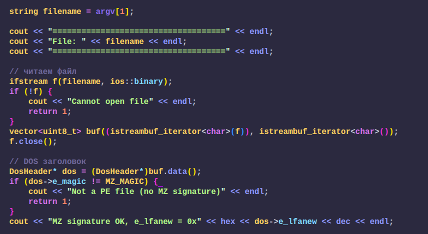

---

## Шаг 2 — NT заголовок и File Header

По смещению `e_lfanew` находится NT заголовок. Сначала идёт 4 байта сигнатуры (`0x00004550` = "PE\0\0"), потом `FileHeader`.

NT заголовок — также известный как PE заголовок, представляет собой важную часть структуры формата PE файла. Данная структура состоит из трёх частей: поле Signature, структура `IMAGE_FILE_HEADER`, а также структура `IMAGE_OPTIONAL_HEADER`.

Основные поля `FileHeader` которые я вывожу:

- **Machine** — содержит значение архитектуры процессора. `0x014C` — x86, `0x8664` — AMD64
- **NumberOfSections** — содержит количество секций PE файла
- **TimeDateStamp** — содержит дату создания PE файла в формате Unix timestamp
- **Characteristics** — содержит различные атрибуты PE файла, например является ли он .exe или .dll

Написал функцию `printFileCharacteristics()` которая проверяет каждый бит через `&` и выводит название флага.

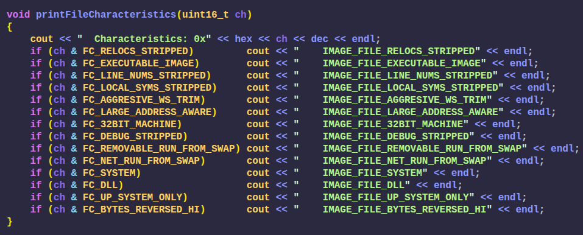

---

## Шаг 3 — Optional Header

Хоть данный заголовок и называется опциональным, на самом деле это самый важный заголовок PE файла. Для x86 и x64 структуры разные (`OptionalHeader32` и `OptionalHeader64`), поэтому я сначала проверяю поле `Machine` и потом привожу указатель к нужной структуре.

Основные поля которые вывожу:

- **Magic** — определяет является ли исполняемый файл 32-разрядным (`0x10B`) или 64-разрядным (`0x20B`)
- **AddressOfEntryPoint** — содержит RVA точки входа в программу. RVA это смещение в байтах от начала адреса загрузки PE файла в память
- **ImageBase** — содержит адрес по которому PE файл загрузится в память
- **SectionAlignment** — содержит значение для выравнивания секций PE файла в памяти
- **FileAlignment** — содержит значение для выравнивания физических данных, равно `0x200`
- **SizeOfImage** — содержит значение виртуального размера всего образа PE файла в памяти
- **DllCharacteristics** — вывожу побитово через `printDllCharacteristics()`

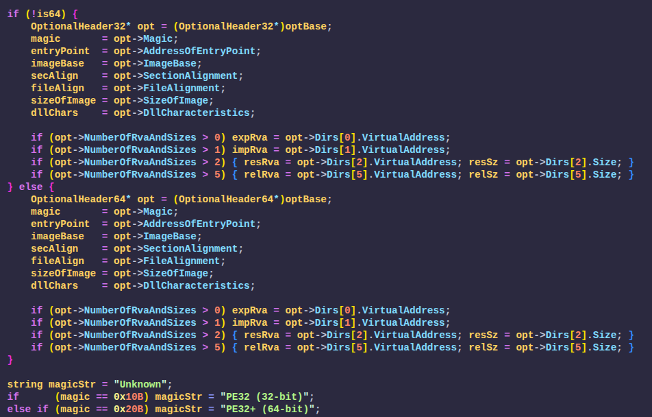
---

## Шаг 4 — RVA в смещение файла

Чтобы найти таблицы экспортов и импортов нужно переводить RVA (Relative Virtual Address) в смещение внутри файла. Написал функцию `rvaToOffset()` — она проходит по всем секциям и проверяет попадает ли RVA в диапазон виртуальных адресов секции, если да — вычисляет смещение.

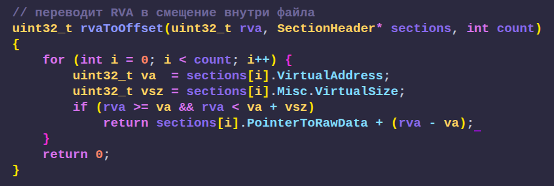

---

## Шаг 5 — Таблица экспортов

Таблица экспорта — структура `ExportDirectory`. Можно выделить 3 основных массива:

- **AddressOfFunctions** — указывает на массив с адресами экспортированных функций
- **AddressOfNames** — указывает на массив с адресами на имена экспортируемых функций
- **AddressOfNameOrdinals** — указывает на массив с порядковыми номерами для экспортированных функций

В коде прохожу циклом по `NumberOfNames` и для каждой функции вывожу ordinal, RVA и имя.

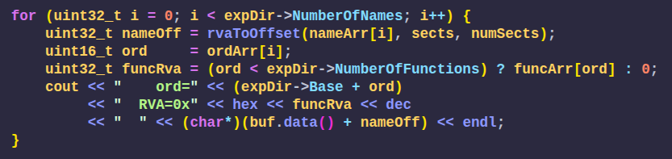

---

## Шаг 6 — Таблица импортов

Директория импорта — это структура данных которая содержит информацию о функциях которые EXE или DLL импортируют из других DLL. Таблица импортов это массив структур `ImportDescriptor`, конец обозначается нулевым дескриптором.

Внутри каждого дескриптора `OriginalFirstThunk` указывает на массив структур `ImportByName`. Каждый элемент — либо импорт по имени, либо по ordinal (если установлен старший бит).

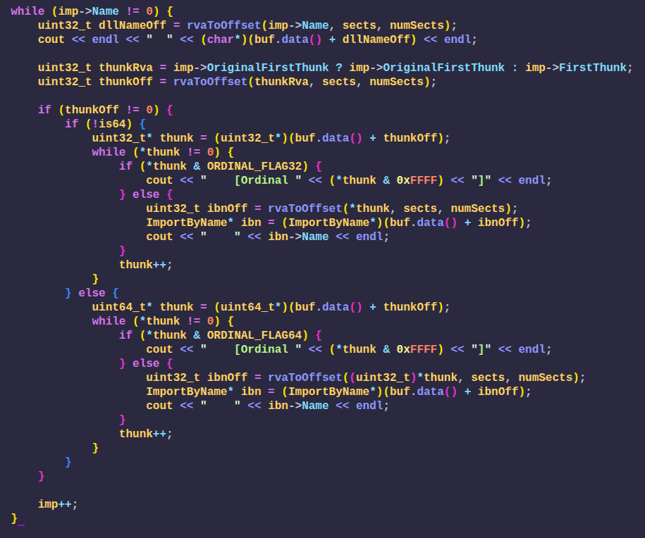

---

## Шаг 7 — Релокации и Ресурсы

Релокации необходимы PE файлу для того чтобы если образ загрузился по адресу отличному от поля `ImageBase` то можно было пересчитать жёстко привязанные адреса.

Ресурсы PE файла включают в себя различные элементы такие как иконки, изображения, диалоговые окна, строки, меню и другие данные необходимые для работы приложения.

Для обоих просто проверяю RVA из `DataDirectory` и если не ноль — выдаю предупреждение.

---

## Шаг 8 — Секции

После NT заголовка идёт `IMAGE_SECTION_HEADER` который описывает информацию о каждой секции. Количество секций в поле `NumberOfSections`. Структура занимает 40 байт.

Вывожу для каждой секции:
- Название (Name, 8 байт, не обязательно null-terminated)
- VirtualSize — общий размер секции при загрузке в память
- VirtualAddress — RVA начала секции
- SizeOfRawData — физический размер секции
- PointerToRawData — физическое смещение начала секции
- Characteristics — флаги доступа буквами R/W/X

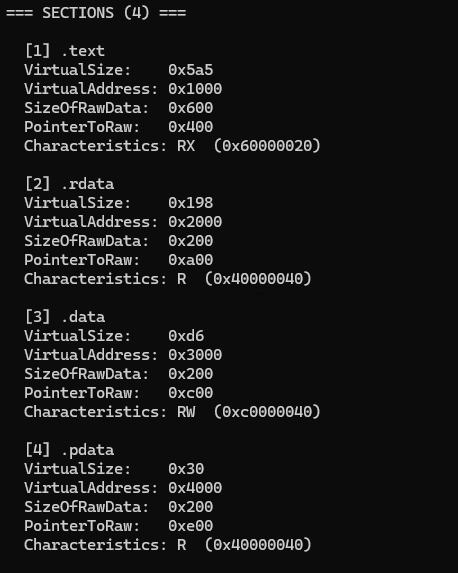

---

## Исходный код

Файл: `main.cpp`

---

## PE1.dll

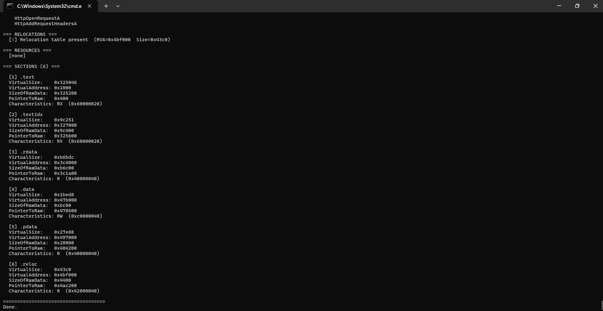
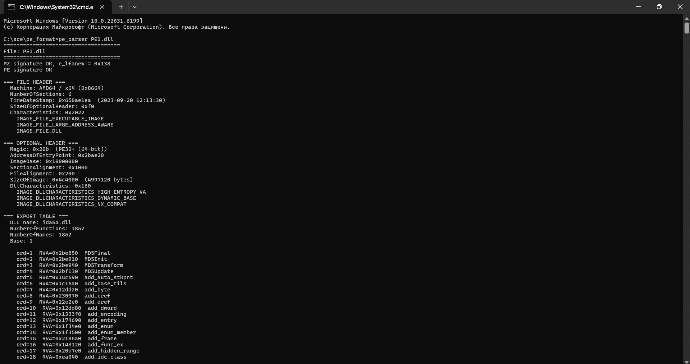
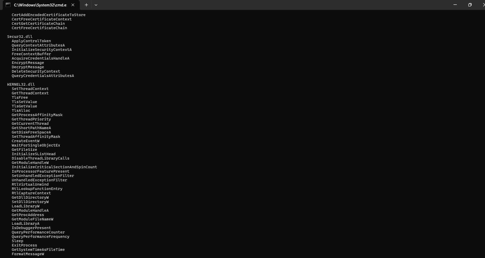

## PE2.exe

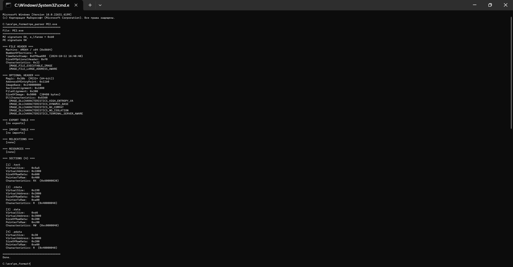
